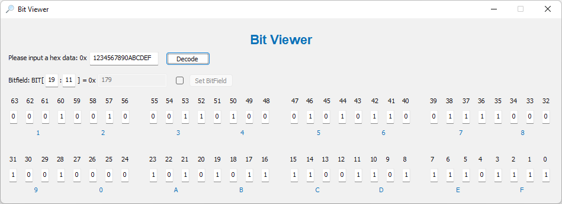

# Introduction
A Windowns application to view the bit value of a hex data.
1. Show each bit of a hex data.
2. Show the bitfield specified by the StartBit and the EndBit from hex data.

# Build Environment
1. Windows OS
2. Visual Studio 2019

# Screenshot

Enjoy coding, enjoy life. 🌹
