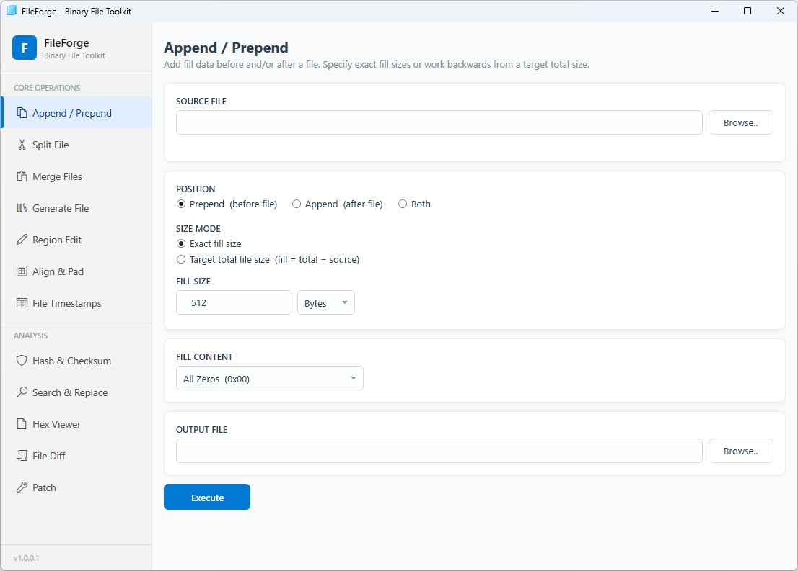

# FileForge

A desktop binary file toolkit built with WPF (.NET 4.8). Provides the most common binary/hex file operations in a clean, modern interface — no cloud upload required, everything runs locally.

  

---

## Screenshots



---

## Features

### Core Operations

| Feature | Description |
|---|---|
| **Append / Prepend** | Add fill data before and/or after a file. Supports exact fill sizes or target-total-size mode. Fill content: all zeros, a specific byte, a repeating hex pattern, or random data. In **Both** mode any two of (front fill, back fill, target total) can be specified and the third is calculated automatically. |
| **Split File** | Split a file into equal-sized chunks or at explicit byte offsets. Customizable output filename pattern using `{name}`, `{n}`, `{ext}` placeholders. |
| **Merge Files** | Combine multiple files into one. Drag-and-drop reordering, optional separator bytes between files. |
| **Generate File** | Create a new binary file of an exact size filled with chosen data. Size input accepts decimal or hex (`0x...`) formats and supports unit suffixes (Bytes/KB/MB/GB). Fill content options match Append/Prepend: all zeros, a specific byte, a repeating hex pattern, or random data. |
| **Region Edit** | Five operations on byte regions within a file: **Extract** a range to a new file, **Insert** bytes at an offset, **Delete** a range, **Overwrite** a range with fill data, **Truncate** the file to a given size. |
| **Align & Pad** | Pad a file to the next multiple of a specified alignment boundary. |
| **File Timestamps** | View and modify the **creation**, **last-modified**, and **last-access** timestamps of any file. Supports manual date/time entry, per-field "Now" buttons, and one-click reset to the values last read from disk. |

### Analysis

| Feature | Description |
|---|---|
| **Hash & Checksum** | Compute MD5, SHA-1, SHA-256, SHA-512 and CRC-32 for an entire file or a specific byte region. One-click copy per hash or copy all. |
| **Search & Replace** | Search a binary file for a hex pattern (supports `??` wildcards). Optionally replace all matches with a different byte sequence. Results list with copy-to-clipboard. |
| **Hex Viewer** | Full-file binary viewer using memory-mapped I/O — works on files of any size without loading into RAM. Features: byte selection, hex/string search with wildcard support, Go-to-Offset navigation, drag-and-drop file open, and **Export as C Header** (converts the whole file or the current byte selection into a `.h` array ready to embed in firmware or C/C++ projects). |
| **File Diff** | Byte-by-byte comparison of two files. Lists every differing offset with hex and ASCII values. Export diff report to text. |
| **Patch** | Apply a list of patch entries (offset + new bytes) to a file. Import/export patch scripts in `.fpatch` tab-delimited format. |

---

## Requirements

- Windows 10 / 11
- [.NET Framework 4.8](https://dotnet.microsoft.com/en-us/download/dotnet-framework/net48)

---

## Getting Started

1. Clone or download the repository.
2. Open `FileForge.sln` in Visual Studio 2019 or later.
3. Build and run (`Debug` or `Release`). No NuGet packages required.

---

## File Format: `.fpatch` Patch Script

Patch scripts are plain tab-delimited text files (UTF-8). Each non-blank, non-comment line is one patch entry:

```
# comment lines start with #
<offset>  <TAB>  <hex bytes>  [<TAB>  <description>]
```

- **offset** — decimal or hex (`0x…`)
- **hex bytes** — space-separated hex pairs, e.g. `DE AD BE EF`
- **description** — optional label shown in the patch list

Example:
```
0x00000010	90 90 90 90	NOP sled
0x000001A4	01 00	Enable flag
```

---

## License

This project is licensed under the BSD-2-Clause license.
