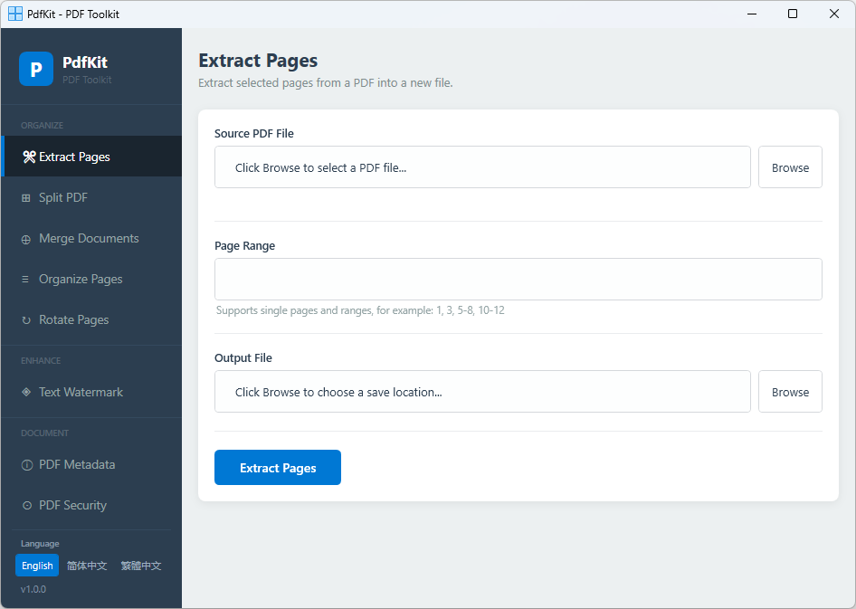

# PdfKit

A lightweight desktop PDF toolkit built with WPF (.NET 4.8) and [PDFsharp](http://www.pdfsharp.net/). Provides the most common PDF operations in a clean, modern interface — no cloud upload required, everything runs locally.

  

---

## Screenshots

App screenshots (click to enlarge):

## Features

### Organize
| Feature | Description |
|---|---|
| **Extract Pages** | Pull a subset of pages from a PDF into a new file using flexible page ranges (e.g. `1-3, 5, 8-10`) |
| **Split** | Divide a PDF into multiple files — either by a fixed page count per file, or by explicit custom ranges |
| **Merge** | Combine multiple PDF files into one; drag-and-drop to reorder, move up/down, or remove files before merging |
| **Organize Pages** | Load a PDF's pages into an editable list, then reorder, delete, or insert pages from another PDF at any position |
| **Rotate Pages** | Rotate all pages or a specific range by 90°, 180°, or 270° |

### Enhance
| Feature | Description |
|---|---|
| **Watermark** | Stamp a customizable text watermark onto pages — control font size, opacity, color (12 presets), position (3×3 grid), rotation angle, and target page range |

### Document
| Feature | Description |
|---|---|
| **Metadata** | Read and edit PDF document properties: Title, Author, Subject, Keywords, Creator |
| **Security** | **Encrypt** a PDF with user + owner passwords and fine-grained permissions (print, copy, modify); **Remove** an existing password from a protected PDF |

---

## Multilingual Support

The UI supports three languages and can be switched at runtime without restarting the application:

- 🇺🇸 English
- 🇨🇳 简体中文 (Simplified Chinese)
- 🇹🇼 繁體中文 (Traditional Chinese)

Language is auto-detected from the system locale on startup.

---

## Requirements

- Windows 10 / 11
- [.NET Framework 4.8](https://dotnet.microsoft.com/en-us/download/dotnet-framework/net48)

---

## Getting Started

1. Clone or download the repository.
2. Open `PdfKit.sln` in Visual Studio 2019 or later.
3. Restore NuGet packages (`PDFsharp 1.50`).
4. Build and run (`Debug` or `Release`).

---

## License

This project is licensed under the MIT License.

Third-party components bundled with this project retain their original licenses. This project uses PDFsharp (MIT License) — see http://www.pdfsharp.net/ for details.

---
