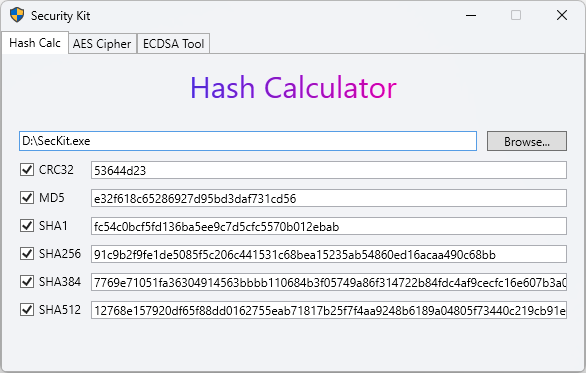
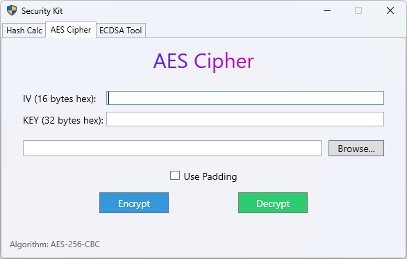
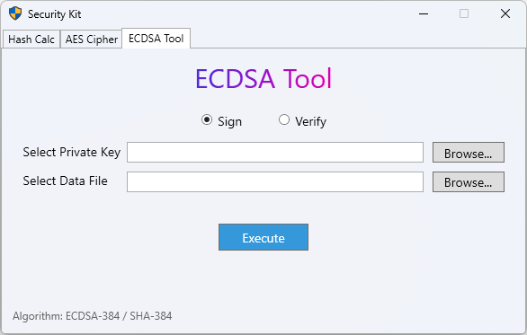

# Security Kit

Security Kit is a multi-functional cryptographic tool featuring three main tabs: **Hash Calculator**, **AES Cipher**, and **ECDSA Tool**. Each tab provides specialized functionality for cryptographic operations with a user-friendly interface.

---

## Features

### 1. Hash Calculator

- **Supported Algorithms:**
  - CRC32
  - MD5
  - SHA1
  - SHA256
  - SHA384
  - SHA512
- **Functionality:**
  - Calculate hash values for input data using any of the supported algorithms.
- **Keyboard Shortcuts (Hash Calculator tab only):**
  - `Ctrl + Shift + C`: Copy the hash result to the clipboard
  - `Ctrl + S`: Save the hash result to a file

- **Screenshot:**

---

### 2. AES Cipher

- **Supported Cipher:**
  - AES-256-CBC
- **Functionality:**
  - Encrypt or decrypt data using AES-256-CBC mode.
  - Support PKCS#7 padding.
  - Requires user-provided IV and Key.

- **Screenshot:**

---

### 3. ECDSA Tool

- **Supported Algorithm:**
  - ECDSA-384 with SHA-384
- **Functionality:**
  - Sign data using a selected ECDSA private key.
  - Verify signatures using a selected ECDSA public key.

- **Screenshot:**

---

## Getting Started

1. Launch the application.
2. Select the desired tab for your cryptographic operation.
3. Follow the on-screen instructions for each tool.
4. Use keyboard shortcuts in the Hash Calculator tab for efficient workflow.

## Runtime and Development Environment
| OS                  | Windows Only                     |
|---------------------|----------------------------------|
| Runtime environment | Windows 11 Build 22621+ / .NET 8  |
| Development         | Visual Studio 2022               |