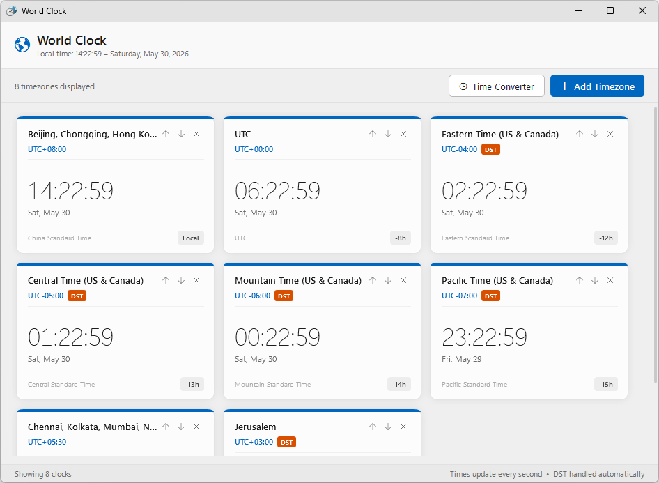

# World Clock

A Windows world clock app built with WPF (.NET Framework 4.8). Displays multiple timezones simultaneously with real-time updates, DST awareness, and a meeting time converter.

 

---

## Screenshots



---

## Features

- **Multiple timezone clocks** - add any timezone from the full Windows timezone database; cards show local time, date, UTC offset, and relative offset from your local time
- **DST awareness** - daylight saving time is detected automatically and shown as a badge on the card
- **Time Converter** - pick any date and time (local) to instantly see the equivalent moment across all your clocks; useful for scheduling cross-timezone meetings
- **Win11 Acrylic** - the window uses the Windows 11 system Acrylic backdrop (requires Windows 11 22H2+; gracefully degrades on older systems)
- **Reorder & remove** - move cards up/down or remove them with toolbar buttons on each card
- **Keyboard shortcut** - `Ctrl+N` to open the Add Timezone dialog

## Requirements

- Windows OS (Acrylic effect requires Windows 11 22H2 or later)
- .NET Framework 4.8

## Building

Open `WorldClock.sln` in Visual Studio 2019 or later and build.

```
MSBuild WorldClock.sln /t:Rebuild
```

## Default Timezones

On first launch the following clocks are pre-loaded:

| Clock | Timezone |
|---|---|
| Local | Your system timezone |
| UTC | Coordinated Universal Time |
| New York | Eastern Standard Time |
| Chicago | Central Standard Time |
| Denver | Mountain Standard Time |
| Los Angeles | Pacific Standard Time |
| Mumbai | India Standard Time |
| Tel Aviv | Israel Standard Time |
